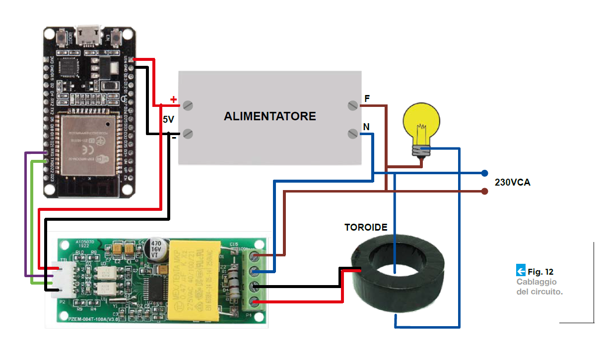
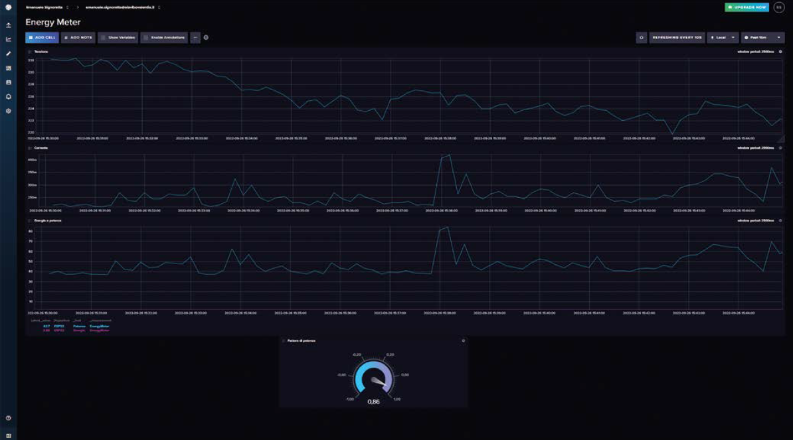

# ESP32 Energy Meter

For the English version click [here](README_EN.md).

Questa è una piccola introduzione al mio progetto pubblicato su [ElettronicaIN #269](https://futuranet.it/prodotto/n-269-novembre-2022/).

Questo progetto è un semplice rilevatore dei consumi basato su una scheda ESP32, un sensore PZEM004 e il servizio di InfluxDb Cloud.

# Hardware

- Una scheda [ESP32](https://futuranet.it/prodotto/esp32-scheda-di-sviluppo-32-gpio-con-wifi-e-bluetooth/)

- Un sensore[PZEM004T](https://futuranet.it/prodotto/energy-meter-100-a-uscita-ttl/)

- Jumpers

- Cavo USB

- Un alimentatore da 220V AC a 5v DC

- Una scatola di plastica per l'elettronica

# Software

Lo sketch e la libreria Every possono essere scaricati [qui](https://futuranet.it/prodotto/n-269-novembre-2022/#tab-tab_contenuti) (è necessario essere registrati al sito).

Altro software necessario:

- Arduino IDE

- La libreria Every (Per eseguire codice ad intervalli regolari senza fare uso dei delay)

- La libreria WiFiMulti(Per gestire la connettività wireless)

- La libreria [ArduinoOTA](https://github.com/espressif/arduino-esp32/tree/master/libraries/ArduinoOTA), WiFiUdp e ESPmDNS (Per gestire il caricamento degli sketch via OTA-)

- Le librerie [InfluxDbClient e InfluxDbCloud](https://github.com/tobiasschuerg/InfluxDB-Client-for-Arduino) (per gestire l'upload dei dati verso i server di Influx DB Cloud)

- La libreria [PZEM004Tv30](https://github.com/mandulaj/PZEM-004T-v30) (Per gestire la comunicazione seriale tra l'ESP32 e il sensore)

- [Python v2.7](https://www.python.org/download/releases/2.7/) installato sul tuo computer per caricare gli sketch via OTA.

# Cablaggio



# Utilizzo

Registrati sul sito di Influx DB Cloud, crea un bucket e genera una chiave API per permettere il caricamento dei dati.

Apri lo sketch e lascia i seguenti parametri così come sono. Se vuoi puoi cambiare il nome del dispositivo (verrà mostarto sulla dashboard), specialmente se hai intenzione di creare una flotta di energy meter.

```arduino
#define DEVICE "ESP32"
#define PZEM_RX_PIN 27
#define PZEM_TX_PIN 26
#define PZEM_SERIAL Serial2
```

Modifica il codice di seguito in modo tale da rispettare la configurazione della tua rete e i tuoi dati dell'account Influx DB.

```arduino
IPAddress local_IP(192, 168, 178, 154);
IPAddress gateway(192, 168, 178, 1);
IPAddress subnet(255, 255, 255, 0);
IPAddress primaryDNS(192, 168, 178, 1); //optional
IPAddress secondaryDNS(1, 1, 1, 1); //optional

// WiFi AP SSID
#define WIFI_SSID "WiFi_SSID"
// WiFi password
#define WIFI_PASSWORD "WiFi_PASSWD"
// InfluxDB v2 server url, e.g. https://eu-central-1-1.aws.cloud2.influxdata.com (Use: InfluxDB UI -> Load Data -> Client Libraries)
#define INFLUXDB_URL "https://eu-central-1-1.aws.cloud2.influxdata.com"
// InfluxDB v2 server or cloud API token (Use: InfluxDB UI -> Data -> API Tokens -> Generate API Token)
#define INFLUXDB_TOKEN "INSERT_TOKEN_HERE"
// InfluxDB v2 organization id (Use: InfluxDB UI -> User -> About -> Common Ids )
#define INFLUXDB_ORG "INSERT_ORG_ID_HERE"
// InfluxDB v2 bucket name (Use: InfluxDB UI ->  Data -> Buckets)
#define INFLUXDB_BUCKET "INSERT_BUCKET_NAME_HERE"
```

Carica lo sketch sulla scheda, torna sul sito di Influx DB Cloud per creare ed editare una dashboard a tuo piacimento.

Una volta fatto, tutto apparirà come nella foto di seguito:


Sentiti libero di editare lo sketch, di migliorarne le funzionalità e di inviare delle pull requests.

Il template per del file README è stato preso da [qui](https://github.com/bremme/arduino-project/blob/master/README.md)
