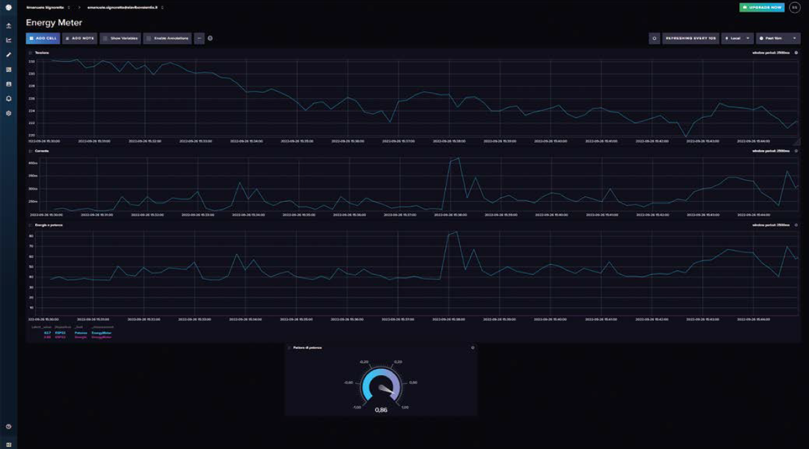

# ESP32 Energy Meter - EN

For the Italian version click [here](README.md)

This is a brief introduction to my project published on [ElettronicaIN #269]([N. 269 - Novembre 2022 - FuturaShop](https://futuranet.it/prodotto/n-269-novembre-2022/).

This project is a simple energy meter based on an ESP32 board, a PZEM004T sensor and the InfluxDb Cloud service.

# Hardware

- [ESP32 board]([ESP32 breakout](https://store.open-electronics.org/ESPWROOM32_ESP32_ESP-32S_DevelopmentBoard)

- [PZEM004T](https://futuranet.it/prodotto/energy-meter-100-a-uscita-ttl/) sensor

- Jumper wires

- USB cable

- 220V AC to 5V DC power supply

- Plastic box for electronics

# Software required

The sketch and the Every library can be downloaded [here]([N. 269 - Novembre 2022 - FuturaShop](https://futuranet.it/prodotto/n-269-novembre-2022/#tab-tab_contenuti)) (registration is required).

Other software needed:

* Arduino IDE

* Every Arduino library (to run code at fixed intervals without using delays)

* WiFiMulti library (to handle WiFi connection)

* [ArduinoOTA]([arduino-esp32/libraries/ArduinoOTA at master · espressif/arduino-esp32 · GitHub](https://github.com/espressif/arduino-esp32/tree/master/libraries/ArduinoOTA), WiFiUdp and ESPmDNS libraries (to handle the OTA sketch upload)

* [InfluxDbClient and InfluxDbCloud]([GitHub - tobiasschuerg/InfluxDB-Client-for-Arduino: Simple library for sending measurements to an InfluxDB with a single network request. Supports ESP8266 and ESP32.](https://github.com/tobiasschuerg/InfluxDB-Client-for-Arduino)) libraries (to handle the data upload)

* [PZEM004Tv30]([GitHub - mandulaj/PZEM-004T-v30: Arduino library for the Updated PZEM-004T v3.0 Power and Energy meter](https://github.com/mandulaj/PZEM-004T-v30)) library (to handle the serial communication between ESP32 and the sensor)

* [Python v2.7]([Python 2.7.0 Release | Python.org](https://www.python.org/download/releases/2.7/)) installed on your pc to flash the firmware OTA

# Wiring


# Usage

Register on InfluxDb cloud, create a bucket and generate the API key to authorize data upload.

Open the sketch and leave the following parameters as they are. If you want you can change the device name (it will be displayed on the Influx Db dashboard), especially if you're planning to create a fleet of energy meters.

```arduino
#define DEVICE "ESP32"
#define PZEM_RX_PIN 27
#define PZEM_TX_PIN 26
#define PZEM_SERIAL Serial2
```

Edit the following code in order to match your network configuration and your Influx Db Cloud data.

```arduino
IPAddress local_IP(192, 168, 178, 154);
IPAddress gateway(192, 168, 178, 1);
IPAddress subnet(255, 255, 255, 0);
IPAddress primaryDNS(192, 168, 178, 1); //optional
IPAddress secondaryDNS(1, 1, 1, 1); //optional

// WiFi AP SSID
#define WIFI_SSID "WiFi_SSID"
// WiFi password
#define WIFI_PASSWORD "WiFi_PASSWD"
// InfluxDB v2 server url, e.g. https://eu-central-1-1.aws.cloud2.influxdata.com (Use: InfluxDB UI -> Load Data -> Client Libraries)
#define INFLUXDB_URL "https://eu-central-1-1.aws.cloud2.influxdata.com"
// InfluxDB v2 server or cloud API token (Use: InfluxDB UI -> Data -> API Tokens -> Generate API Token)
#define INFLUXDB_TOKEN "INSERT_TOKEN_HERE"
// InfluxDB v2 organization id (Use: InfluxDB UI -> User -> About -> Common Ids )
#define INFLUXDB_ORG "INSERT_ORG_ID_HERE"
// InfluxDB v2 bucket name (Use: InfluxDB UI ->  Data -> Buckets)
#define INFLUXDB_BUCKET "INSERT_BUCKET_NAME_HERE"
```

Upload the sketch to your board and move to Influx Db Cloud website to create and edit a dashboard as you prefer.

Once done, everything will look like this:

 


Feel free to edit the sketch, to improve the functionalities and to send pull requests.

Readme template taken from [here]([arduino-project/README.md at master · bremme/arduino-project · GitHub](https://github.com/bremme/arduino-project/blob/master/README.md))
